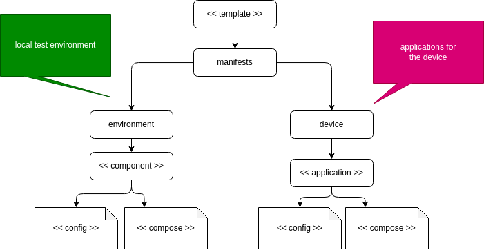

# mender-containerized-apps

Template project to create multi-application deployments for mender based systems.



 ## prepare a edge device

requirements: 
* Ubuntu 22.04

To prepare a ubuntu based system, please login into your device and run the following install script.

```bash
./node/install.sh
```

## Add a application

Applications are located under `manifests/device/<<applications>>`

1. copy the application template folde, modigy the docker-compose file and add your configurations etc.
2. For local development, add the application to `manifests/device/Tiltfile`
3. To create the artifact for yo

## Local development

